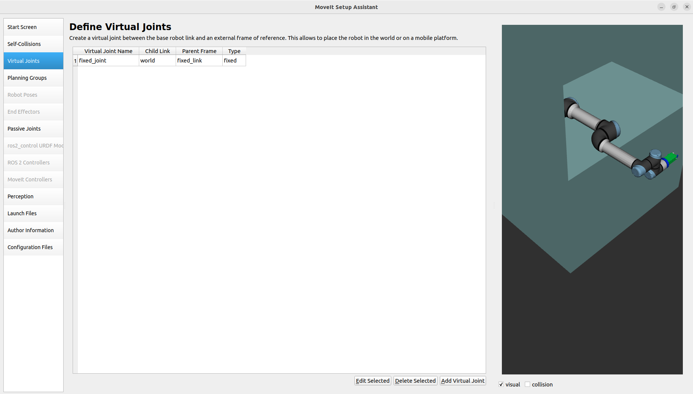

# MOVEIT SETUP ASSISTANT
Contents
1. Introduction 
2. Using a URDF file with the setup assistant
    - Introduction to the MoveIt! Setup Assistant 
    - Configure your robot with the MoveIt! Setup Assistant 
3. MoveIt! Usage
    - demo.launch 

---
# 1. Introduction

This tutorial explains the basics of how to describe industrial robots in ROS and how to use the created kinematic models. You will learn about the Unified Robot Description Format (URDF). The tutorial will inform about how to create a robot model, how to visualize your robot and begin with easy planning for your model.
- Lines beginning with $ are terminal commands
- Lines beginning with # indicate the syntax of the commands
- The symbol → represents a line break. 

---
# 2. Using a URDF file with the setup assistant

A URDF file can be used from several ROS tools, e.g. as robot model in
the Gazebo Simulation environment, as visualization element in rviz or as a kinematic model for MoveIt!.   

MoveIt! is the most widely used Open Source software for motion planning,
manipulation, 3D perception, kinematic, control and navigation.   

It provides an easy-to-use platform for developing advanced robotics applications, evaluating new robot designs and building integrated robotics products.

## Introduction to the MoveIt! Setup Assistant

The MoveIt! Setup Assistant is a powerful graphical tool to configure any robot you want to use with MoveIt!. The main task of the Setup Assistant consists in generating the Semantic Robot Description Format (SRDF), which is used in the ROS node move_group.   
Check http://wiki.ros.org/srdf for further information.   
Besides the SRDF, there are a lot of other configuration files generated e.g. for joint limits, kinematics and motion planning.   
The only information the tool needs is the Unified Robot Description Format (URDF) of the robot, i.e. the file that you have created recently.   

## Configure your robot with the MoveIt! Setup Assistant

To start the Setup Assistant you need the following command:

`ros2 launch moveit_setup_assistant setup_assistant.launch.py`   

A graphical user interface comparable to figure 1 should appear.   

   
Figure 1: MoveIt! Setup Assistant start screen

- Select the Create New MoveIt! Configuration Package button and browse for the file called ur_demo_description.urdf.xacro in `~/moveit_ws/src/ur5e_cell/ur5e_cell_description/urdf/` .
This file includes the URDF file you edited in the URDF tutorial. Your window should look like shown in figure 2.
- Click on the Load Files button and after a few seconds the Setup Assistant will present
you a model of the robot on the right side of the window.
- Afterwards click on the Self Collision pane selector to generate a matrix for pair of links which are not necessary to be checked for collision every time at planning process. This is because they are either always in collision or never in collision.

   
Figure 2: Choose mode and select URDF

- Change the Sampling Density to maximum possible
- Select the Regenerate Default Collision Matrix button
- After a few seconds the MoveIt! Setup Assistant will present you the results of the computation. Have a look at figure 3 for reference.

  
Figure 3: Results for the Default Collision Matrix   

- Now add a virtual joint to attach your robot to the world.
    - Select the Virtual Joint pane selector
    - Click on the Add Virtual Joint button
    - Set the joint name to "fixed_joint"
    - Set the child link as "world" and the parent link as "fixed_link"
    - Set the joint type as "fixed"
    - Now save the data and your screen should look like shown in figure 4.

  
Figure 4: Virtual Joints   

- In the next step you will define your planning group for which MoveIt! later on tries to
compute a path.
    - Click on the **Planning Groups** pane selector on the left
    - Click on **Add Group** at the bottom
    - Set the Group Name as "manipulator"
    - Choose `kdl_kinematics_plugin/KDLKinematicsPlugin` as the Kinematic solver.
    - Click on the **Add Kin. Chain** button and choose "base_link" as Base Link and "tool_tip" as Tip Link.  
    - Click "Save". See the result in figure 5 for reference. 

    
Figure 5: Add Planning Group "arm"   

- The Setup Assistant includes the option to add poses. It is helpful to define poses that
will be used often in later developing process e.g. a home pose for the robot.
    - Select Robot Poses
    - Click the Add Pose button
    - Choose a name for the pose and move the joints to a position that you like
    - Save the Pose
- Skip the End Effectors and Passive Joints pane selectors.
-Click on **Configuration Files**, click **Browse** and select path till "src" inside your workspace and manually name the package "ur5_demo_moveit_config" as shown in figure 6.

    
Figure 6: Configuration Files

- Click "Generate Package"
- If the process completes successfully you can try out your newly created MoveIt! configuration as described in the next section

---
# 3. MoveIt! Usage

This section makes actual use of your newly created MoveIt! Package.

##

You can try out your newly created MoveIt! package by launching the following:   
`ros2 launch ur5e_cell_bringup ur5e_cell_bringup.launch.py`   
RViz should start and the UR5 should be visualized.

- Uncheck: Displays -> Motion Planning -> Planned Path -> Loop Animation
- Set: Motion Planning -> Planning Request -> Interactive Marker Size -> 0.1   
- Select: Motion Planning -> Context -> Planning Library -> RRTConnectkConfigDefault
- Select: Motion Planning -> Planning -> Query -> Select Start State -> Update
- Select: Motion Planning -> Planning -> Query -> Select Goal State -> Update
- Click on the Plan Button in the Commands category
    - You should see the robot moving on the computed path from the Start State pre sented in blue and silver to the Goal State presented in yellow (figure 7)
- Click on the Execute Button in the Commands category
    - The Start State should now be at the selected Goal State

You should get a screen similar to figure 7.

   
*Figure 7: Motion planning in RViz*

You can now use RVIZ and move around the interactive markers (the RGB arrows and rings on the tip link of the robot) to give goals to Moveit. 

Under the *Context* tab ind the *MotionPlanning* pane, you can select which planner from OMPL (or your custom choice of planning library) you want to use. Note that every planner has strengths and weaknesses, and you might use different planners for different scenarios. You can leave it to *unspecified* and the default of `RRTConnectkConfigDefault` will be chosen, which is usually a good generic choice. If any of your goal states fail to be planned for or plans poorly, you could change the planner to see if that works better.

When ready with a valid goal state, select the *Planning* tab under the *MotionPlanning* pane in RVIZ, and click on **Plan**. If the goal state is valid (no collissions, plannable goal etc...), the planner calculates a plan for you and displays the trajectory. You can now click **Execute** to execute this plan.  

Feel free to plan more goals and play around with any of the parameters to observe the changes they effect. When you are satisfied, you can move on to the next workshop.

> HINT: You could use the RQT Graph tool to see what the computational graph looks like now, consider if everyting looks fine, and compare to the next workshop. Command: `rqt_graph`. You can save this as an image for later reference.

