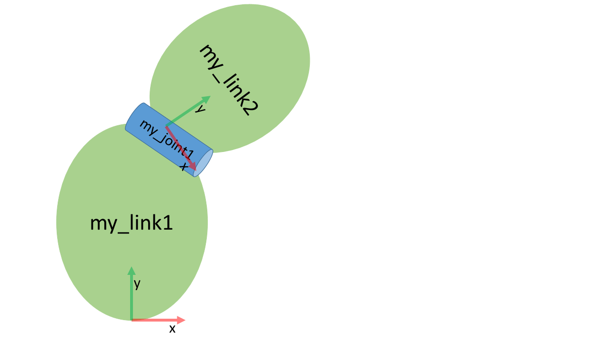

# SIMPLE COMPOSITION

Contents:
* Create a URDF file
* Create a tree structure
* Add dimensions
* Complete kinemtatics

## Introduction
This tutorial explains the basics of how to describe industrial robots in ROS and how to use
the created kinematic models.
You will learn about the Unified Robot Description Format
(URDF). The tutorial will inform about how to create a robot model and how to visualize your
robot.

```bash
cd /home/ws/src/ur5e_cell
git fetch --all --tags
git checkout 2-robot-cell-composition-start
```

## 1. Create a URDF file
A URDF file is created in the XML format. URDFs contain information about the robot links
and joints. For detailed information about this format check the following link:
http://wiki.ros.org/urdf/XML

Figure 1 shows a simple kinematics that can be built using URDF.


Figure 1: Serial kinematics sketch

It is a simple kinematics existing of two links connected via a continuous rotating joint.

## 2. Create the tree structure
The robot in figure 1 is a tree structure. Let's start very simple, and create a description of that
tree structure, without worrying about the dimensions etc. Create a file called ``workcell.urdf.xacro`` in the urdf folder of ``ur5e_cell_description package``:

```xml
<robot name="custom_robot" xmlns:xacro="http://www.ros.org/wiki/xacro">
<link name="link1"/>
<link name="link2" />
<link name="link3" />
<joint name="joint1" type="continuous">
<parent link="link1"/>
<child link="link2"/>
</joint>
<joint name="joint2" type="fixed">
<parent link="link2"/>
<child link="link3"/>
<origin xyz="0 0 0.5"rpy="0 0 0"/>
<axis xyz="0 1 0"/>
</joint>
</robot>
```
So, just creating the structure is very simple! Now let's see if we can get this urdf file parsed. Run the check command to see if the syntax is correct:

```bash
check_urdf robot.urdf
```
## 3. Add dimensions
To add dimensions to our tree, we have to specify the offset from a link to the joint(s) of its
children. To accomplish this, we will add the feld <origin> to each of the joints.
Joint1 is offset in the Z-direction from link1. So, we need to add the following <origin> element:

```xml
<origin xyz="0 0 0.5" rpy="0 0 0"/>
```
Repeat this for every joint element of the URDF. Now run it through the parser and check for
syntax with the command shown above.

## 4. Completing the kinematics
We need to specify around which axis the joints rotate. Once we add that, we actually have a
full kinematic model of this robot! We need to add the ``<axis>`` element to each joint. The axis
specifies the rotational axis in the local frame.
Joint1, you see it rotates around the positive Y-axis. So, simply add the following to the joint
element:

```xml
<axis xyz="0 1 0" />
```

Repeat this for every joint element of the URDF. Now run it through the parser and check for
syntax with the command shown above.
That's it, you created your first URDF robot description!
Now you can try to visualize the
kinematic chain described in the URDF using graphiz:

```bash
cd src
urdf_to_graphiz ur5e_cell/ur5e_cell_description/urdf/workcell.urdf 
```

You can then open the generated pdf on the host machine in the src workspace folder.

To visualize and control this model, run the following command:

```bash
cd ..
colcon build
ros2 launch ur5e_cell_description view_ur_cell.launch.py
```

```{note}
Make sure you always run ``colcon build`` after you make changes to the URDF file.
```
```{note}
Make sure you always run ``colcon build`` in the root folder of the workspace. In our case ``/install/ws/``.
```

However now this will also pop up a GUI that allows you to control the values of all the non-
fixed joints. Play with the model and see how it moves. Then, we can take a look at how we
accomplished this.

**You'll need to set link1 as the Fixed Frame!**

As you move the sliders around in the GUI, the model moves in Rviz. How is this done? First
the GUI parses the URDF and finds all the non-fixed joints and their limits.
Then, it uses
the values of the sliders to publish sensor_msgs/JointState messages. Those are then used by
robot_state_publisher to calculate all of transforms between the different parts. The resulting
transform tree is then used to display all of the shapes in Rviz.

## Cleanup
To clean up the workspace rename workcell.urdf.xacro to workcell.urdf.
