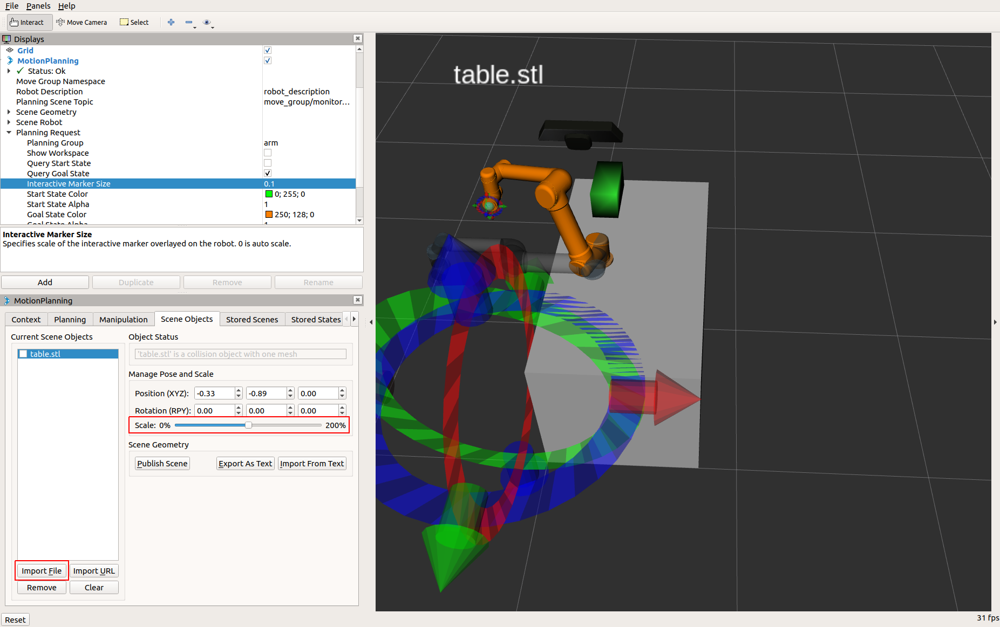

# Exploring Moveit

You have created a new moveit config package for the custom UR5 URDF and used the `demo.launch` to get a quick feel for how it works with RVIZ. This method is useful for quickly verifying the setup assistant process and the validity of the URDF. Unfortunately, what it executes is just fake controllers for this reason. Further configuration is necessary to fully connect Moveit, Gazebo, and the real controllers.   

A thorough description of this process is provided in a nice video by TheConstruct at : https://www.theconstructsim.com/control-gazebo-simulated-robot-moveit-video-answer/   

An example of such a fully configured package with the default base URDF is already available in the *universal_robot* metapackage called `ur5_moveit_config`, which serves as the basis for configuring your own custom URDF based config packages. 

Since this is just clerical work, such a fully configured and tested package is provided to you for this workshop under `rosin-training/moveit_config_pkgs/ur5_moveit_config_pkg`. You can hereafter use the same.   

---

## Starting up the whole stack

The typical procedure to use Moveit for planning with a Simulation or Real robot is to run in separate terminals each of the following:   
1. Launch the Simulation -   
`roslaunch ur5_moveit_config_pkg ur5_gazebo.launch`    
*(you will be using this for the workshops)*      
OR   
Launch the real robot from its ROS driver-   
`roslaunch ur_modern_driver ur5_bringup.launch`   
*(note that this is a separate package and not used in this workshop)*

> IMPORTANT: Click the small play button at the bottom of the Gazebo GUI to start the simulation before going forward. Note also that Gazebo is quite resource intensive, and could slow down your PC a bit.   

2. Launch the fully configured moveit layer -    
`roslaunch ur5_moveit_config_pkg ur5_moveit_planning_execution.launch sim:=true`   
(note that `sim:=true` should not be used in case of the real robot)   

3. Launch RVIZ if needed -   
`roslaunch ur5_moveit_config_pkg moveit_rviz config:=true`   

4. Launch your application -   
*(you will do this in the next workshop)*

What you now have is a simulation/real robot, the moveit layer, and RVIZ all fully connected. Any commands you give via RVIZ will be reflected in Gazebo/the real robot. There are proper controllers running, ensuring that the trajectories get properly executed.   

This general approach remains the same for every robot.   

---

## Playing with Moveit and Gazebo

You can now play with setting goal states, planning and executing as you did with the previous workshop. The difference is, previously it was only a dummy robot state that was being changed. If you check Gazebo/real robot now, you will notice that the sim/actual robot is being affected.

---

## Scene objects

After that you are able to use the Plan and Execute commands again.   
There is also the possibility to add scene objects to your robot model. Change to the **Scene Objects** tab and click the **Import File** button. You can now import a file named `table.stl` in `~/moveit_ws/src/tutorial_commons/meshes/`.  
After you load this object a (possibly giant) box appears. Do not be alarmed, the box is friendly. Use the **Scale** slider to make it smaller & move it somewhere next to the robot using the giant interactive markers (figure 10). Click once the **Publish Scene** button to include the box in the planning environment of the robot.   
Change back to the **Planning** tab. Give a new goal target across this box and execute to it. You will recognize, that the box is avoided because it represents a collision object. See figure 1 for reference.   

   
*Figure 1: Insert a scene object to the MoveIt! planning environment*

---

## Introspection

Launch the RQT Graph tool again to observe what the computation graph looks like now.   

If you had saved the previous graph, you would notice that the `/robot_stat_publisher` came previously from a `/move_group/fake_controller_joint_states` node whereas now it comes from Gazebo/real robot, telling us that the actual robot is being tracked.   

You will also notice a new `/arm_controller/follow_joint_trajectory` action, which now drives the sim/actual robot.   

When you execute a valid plan, echo in terminal the topics in this action, specifically the *goal*, *status* and *result* topics, to see what is being published. The goal shows you what the computed trajectory precisely looks like. This one set of values is the result of the complete Moveit pipeline.