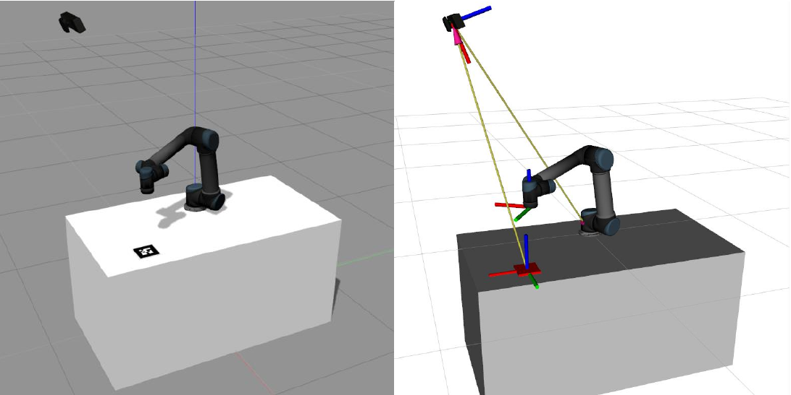
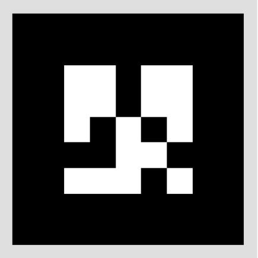
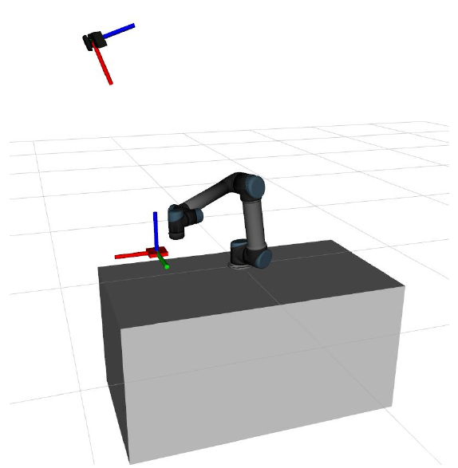

# UR5 AR APPLICATION

## 1. UR5 Simulation setup

This section describes how to start up the UR5 Gazebo simulation, including the Kinect image sensor.

### 1.1 Installation

- gazebo_ros_pkgs (this package is already installed on your system)
- universal_robots (this package has Moveit configuration packages for different Universal robots)

Create a new workspace called *moveit_ws* in your home directory, and clone the universal_robots package and the package for today's tutorials into the *src* directory of this workspace:    

```
git clone git@github.com:ROS-I-Training/moveit2_workshop.git src

sudo apt install python3-vcstool

vcs import src --skip-existing --input src/moveit2_workshop/dependencies_rolling.repos

vcs import src --skip-existing --input src/ur5e_cell/dependencies_rolling.repos

source /opt/ros/rolling/setup.bash

rosdep install --from-paths src --ignore-src -r -y

colcon build --symlink-install

source install/local_setup,bash
``` 
>VERIFY THE ABOVE PACKAGE!!!   

Make sure you compile this workspace and source it.   


### 1.2 Start up

Open each command below in a new terminal:  

**Real robot:**   
To start the perception pipeline and test if Aruco markers work correctly:

```bash
ros2 launch moveit2_workshop_bringup marker_detection.launch.py
```

To start the full demo including marker detection, robot driver, moveit, rviz and demo application:

```bash
ros2 launch moveit2_workshop_bringup full_demo.launch.py
``` 

### 1.3 RVIZ Config
1. Add the “Motion Planning” type into RViz
2. Set the fixed frame to “world”

---

## 2. AR Alvar Tag Detection

Object recognition is essential in higher level robotic applications. To achieve this, the goal in this tutorial is to detect the fiducial markers (“AR Tags”) based on RGB data given by a simulated RGBD camera. 


*Figure 1: Simulation environment*

### 2.1 Installation and Startup


TODO: This part needs to be completed after the final real world test.

AR Markers are fiducial markers (see figure 2). They provide a way of visual pose estimation.    

AR Track  works out of the box by just running it, you only need to determine the length of one side of the tag and the image topic to be used. This is parameterized in the launch file.

```
marker size: 13cm x 13cm
camera image topic: /camera/rgb/image_raw
camera info topic: /camera/rgb/camera_info
output frame: /camera_link
```

   
*Figure 2: AR Tag showing number 1*

When you start up AR-Track Alvar you can visualize the detected AR Tags by enabling the topic `/visualization_marker` in Rviz. You can also visualize (and make use of) tf data provided by AR-Track Alvar as it also represents detected Markers by publishing transforms.   

Once you started it up for the first time and set up the appropriate visualizations in rviz you’ll probably notice a screen like the following:


   
*Figure 3: AR Tags at wrong size*   

This is caused by a wrong value of “marker_size” in the ar.launch file.   
Try to tweak this value until you have a setup as shown in figure 1.
 
 ### 2.3. Output Analysis

Running AR-Track alvar will provide a new topic called `/ar_pose_marker` which provides information about the detected AR Tags. These messages can easily be used in ROS nodes to further interact with the perceived AR Tags.   

---

## 3. Application: "Move arm above AR Tag"

This section describes the final task for this session. It is supposed to wrap up your knowledge about URDF, TF and MoveIt! and create a real-world application with it.

### 3.1. Task description
The final task for the application development is to complete a python node that interacts with the UR5 MoveIt’s *moveit_commander* interface to move the robot’s end- effector above the AR Tag. See figure 1 for further description.   

The node of interest is called <!--arm_move.py--> `mover_to_marker.py` in the `moveit_tutorial` package. It contains several methods to modify the position of the end-effector and to process data given by the AR Track Alvar node.   

> VERIFY THE ABOVE SCRIPT!!!

Your task is to simply **complete the node** to let the arm move above the AR tag in a continuous loop as shown in figure 1. Following is the list of tasks to be completed:   

**Task 1:**   
Instantiate ‘MoveGroupCommander’ with the correct ‘group name’. (line number 16) Refer to Rviz to get the group name in the ‘Motion Planning’ tab   
**OR**    
Check the SRDF file in the *config* folder of the *denso_moveit_config_pkg* package   

**Task 2:**   
Add a subscriber to ar pose marker topic (line number 90)
Find out the message type of the topic from command line using rostopic   
`rostopic info /ar_pose_marker`   

**Task 3:**   
Assign position values from marker_pose to marker (line number 78)   
HINT: *"marker_pose"* is using the message type `geometry_msgs/Pose`
