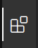
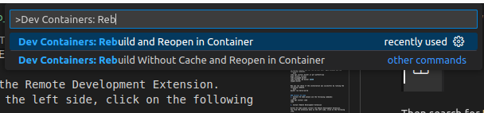

# DEVELOPMENT ENVIRONEMNT SETUP
Contents
* Install VS Code and docker
* Fetch training repository and sources
* Launch Development environment in Docker container


## 1. Install VS Code and Docker
The training will be conducted using Visual Studio Code and Docker Containers. The ROS2 code used in the training will run in a docker container.

### Install Docker
To install docker and set the correct user rights please use the following commands.
```bash
sudo apt install docker.io git python3-pip
pip3 install vcstool
echo export PATH=$HOME/.local/bin:$PATH >> ~/.bashrc
source ~/.bashrc
sudo groupadd docker
sudo usermod -aG docker $USER
newgrp docker
```

Now you can check if the installation was successful by running the following command.
```bash
docker run hello-world
```
You might need to start the Docker Daemon first, if you cannot run hello-world out of the box:
```bash 
sudo systemctl start docker
```

### Install VS Code
1. To install VS Code please use the following commands:
```bash
sudo apt update
sudo apt install software-properties-common apt-transport-https wget -y
wget -q https://packages.microsoft.com/keys/microsoft.asc -O- | sudo apt-key add -
sudo add-apt-repository "deb [arch=amd64] https://packages.microsoft.com/repos/vscode stable main"
sudo apt install code
```

You can run VS Code by typing ``code`` in a terminal.


2. Install Remote Development Extension

Within VS Code please install the Remote Development Extension.
You find the extension menu on the left side, click on the following item.



Then search for ``Remote Development`` and click ``install``.

**Now you are all setup and we can create your workspace.**

## 2. Create a ROS2 workspace
A workspace is the folder structure that you use for development. We need to create a workspace for our training. To do so, please execute the following commands in a terminal.

```bash
cd ~/
mkdir ws_manipulation_workshop
cd ws_manipulation_workshop
mkdir build install log
```

Now we have setup the folder structure and we are ready to download the workshop repositories.

```bash
git clone https://github.com/ipa-cmh/ros2_manipulation_workshop.git src
cd src
vcs import --input manipulation_training.repos
```

**Now your workspace is setup and we are ready to open the development environment.**

## 3. Open workspace in docker and VS Code
Open the ``src`` folder of your workspace in VS Code.

### 1. Edit devcontainer.json for your environment.
For the Dev Container to function properly, we have to build it with the correct user. Therefore open ``.devcontainer/devcontainer.json``

```json
{
    "name": "ROS2 Development Container",
    "privileged": true,
    "remoteUser": "xxx",
    "build": {
        "dockerfile": "DOCKERFILE",
        "args": {
            "USERNAME": "xxx"
        }
    },
    "workspaceFolder": "/home/ws",
    "workspaceMount": "source=${localWorkspaceFolder},target=/home/ws/src,type=bind",
    "customizations": {
        "vscode": {
            "extensions":[
                "ms-vscode.cpptools",
                "ms-vscode.cpptools-themes",
                "twxs.cmake",
                "donjayamanne.python-extension-pack",
                "eamodio.gitlens",
                "ms-iot.vscode-ros"
            ]
        }
    },
    "containerEnv": {
        "DISPLAY": "unix:0",
        "ROS_LOCALHOST_ONLY": "1",
        "ROS_DOMAIN_ID": "42"
    },
    "runArgs": [
        "--net=host"
    ],
    "mounts": [
        "source=/tmp/.X11-unix,target=/tmp/.X11-unix,type=bind,consistency=cached",
        "source=${localWorkspaceFolder}/../build,target=/home/ws/build,type=bind",
        "source=${localWorkspaceFolder}/../install,target=/home/ws/install,type=bind",
        "source=${localWorkspaceFolder}/../log,target=/home/ws/log,type=bind"
    ],
    "postCreateCommand": "sudo rosdep update && sudo rosdep install --from-paths src --ignore-src -y && sudo chown -R xxx /home/ws/"
}
```

Use ``Ctrl+F`` to open the search and replace menu. Search for ``xxx`` and replace with your ``Linux username``. If you do not know your username, you can find it by running ``echo $USERNAME`` in the terminal.


### 2. Build Development Container

Use ``View->Command Pallette...`` or ``Ctrl+Shift+P`` to open the command pallette. Search for command ``Dev Containers: Rebuild and Reopen in Container``. This should look like this.



Now click on the command. This will build your development docker container for your. This will take a while. Sit back or get a coffee.

### 3. Test Container

To test if everything works correctly, open a terminal in the container using ``Terminal->New Terminal``in VS Code. Inside the terminal do the following:

```bash
source /opt/ros/humble/setup.bash
rviz2
```

This should open an empty ``rviz2`` window.
